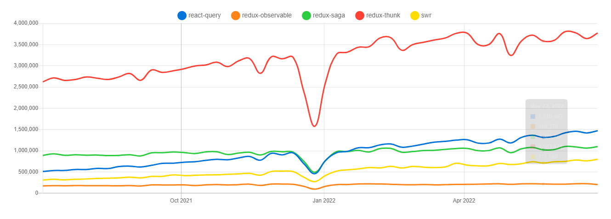

## 🖤 API 통신에 대하여

### ➰ 에러 / 로딩 처리를 하는 방법에는 어떤 것들이 있을까?
>  에러 처리 방법
처리 방법을 따지기 전에 막는 방법 먼저 살펴보자.
##### 에러 전파 최대한 막기
- try catch문과 throw 구문을 예로 들면, 이들은 에러가 발생한 곳에서 에러 처리에 대한 권한을 가장 먼저 갖고, 처리할 수 없는 경우 다른 곳으로 처리를 위임하게 된다. => `에러 전파`
- 에러가 전파되는 3가지의 레이어를 정의하자면 다음과 같을 것이다.
    1. 에러가 최초로 발생한 함수 (e.g. fetch)
    2. 1번 함수의 반환값을 표현하는 컴포넌트
    3. 2번 컴포넌트를 감싸는 에러 바운더리

#### 🔍 React ErrorBoundary (에러 처리 방법)
- ErrorBoundary는 데이터를 가져올 때 에러가 발생하면 그 에러에 대한 핸들링 처리를 위임 받을 수 있는 컴포넌트이다.
- try-catch문처럼 동작한다.

#### 🔍 React Suspense (로딩 처리 방법)
- Suspense는 데이터를 가져올 때 데이터의 준비가 끝나지 않았을 때에는 컴포넌트를 렌더링하지 않고 지정한 컴포넌트를 보여줄 수 있는 컴포넌트를 의미한다.
- children으로 들어간 컴포넌트가 비동기 처리할 때의 처리를 외부인 Suspense로 위임 받을 수 있다.

### ➰ 패칭 라이브러리란 무엇이고 어떤 것들이 있을까?

- React와 함께 사용 가능한 데이터 패칭 라이브러리는 axios, swr, tanstack query(전 react-query), Redux Toolkit Query, Apollo Client가 있다.

### ➰ 패칭 라이브러리를 쓰는 이유는 무엇일까?
> Server State 분리의 필요성

*Server State: 서버로부터 받아오는 state(e.g. 비동기 로직을 통해 세팅하는 state)
- redux에 server state를 같이 관리하게 되면서 store가 점점 비대해지고, 관심사의 분리가 어렵게 되는 문제들이 발생할 수 있다.
- 또한 DB에 있는 자료들을 프론트에서 렌더링하기 위해 임시적으로 redux store에 자료들을 보관하는 용도인데, 시간이 지날수록 실제 DB의 자료와 redux store에 보관된 자료들의 일관성이 깨질 수 있다. 
-> 패칭 라이브러리가 데이터의 일관성 유지를 대신 수행해준다.

- 간편한 비동기 데이터 요청
- 상태관리 및 업데이트 용이
- 캐싱과 최적화
- 로딩, 오류 처리
- 서버사이드렌더링(SSR)과의 호환

출처
https://velog.io/@0715yk/FE-Without-Redux-MiddleWares
https://velog.io/@diso592/%EB%8D%B0%EC%9D%B4%ED%84%B0-%ED%8C%A8%EC%B9%AD-%EB%9D%BC%EC%9D%B4%EB%B8%8C%EB%9F%AC%EB%A6%AC-%EB%B0%B0%EA%B2%BD%EA%B3%BC-%EA%B0%9C%EB%85%90

